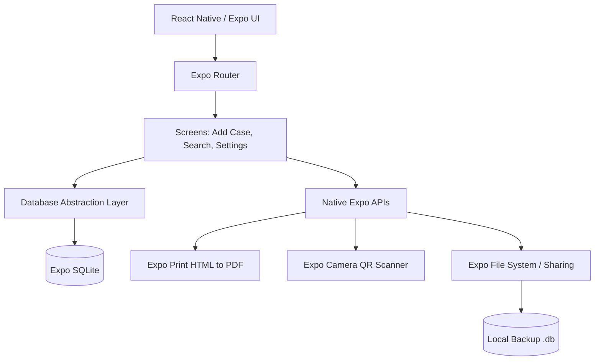
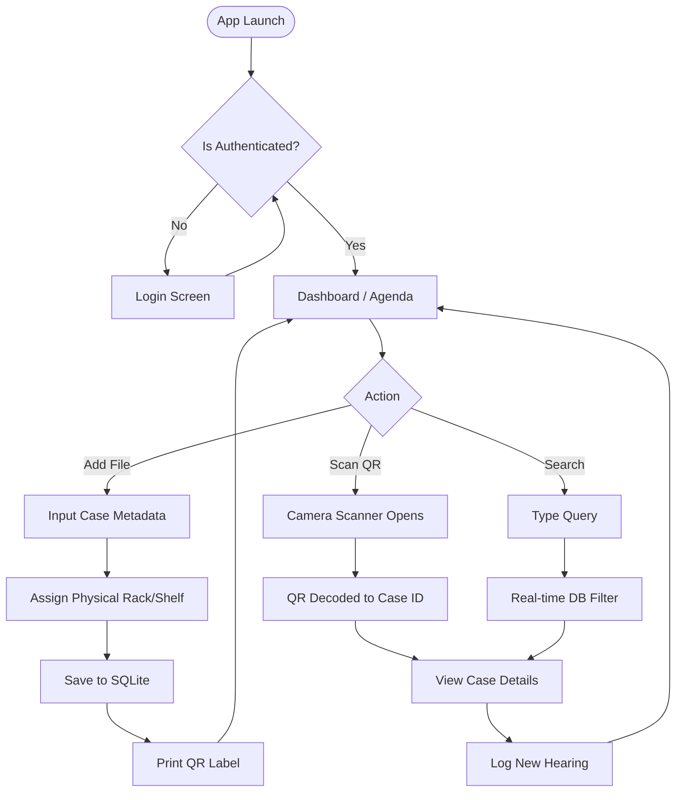
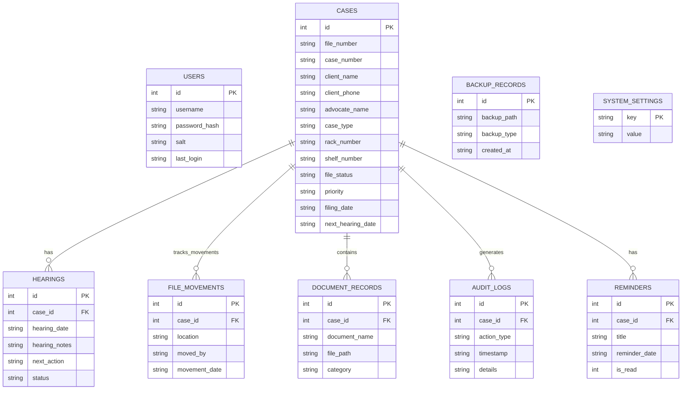
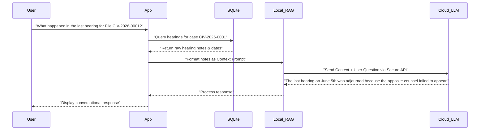

# NyayaRack Android - Complete System Architecture & Documentation

## 1. App Explanation & Overview
**NyayaRack** is an offline-first, mobile-centric physical file management system designed for legal professionals, law firms, and independent advocates. It bridges the gap between physical case folders and digital tracking by utilizing QR codes, real-time logging, and geographical rack-level organization.

The core philosophy is **"Offline-First and Privacy-Focused."** All data is stored securely on the device using an encrypted local SQLite database, ensuring that sensitive client information never leaves the local environment unless explicitly exported by the administrator.

---

## 2. Comprehensive App Features
*   **Physical Rack Mapping**: Map physical files to specific coordinates in an office (`Rack Number`, `Shelf Number`, `Position`).
*   **Instant QR Retrieval**: Print folder labels with auto-generated QR codes. Scanning these codes with the built-in camera retrieves the exact case file instantly.
*   **Hearing Timeline Logging**: Track the lifecycle of a case by logging hearing dates, notes, next actions, and outcomes (Pending, Adjourned, Completed).
*   **Advanced Real-Time Search**: Search through thousands of local records instantly using partial matches on names, phones, case numbers, or file numbers.
*   **Local Security**: Application access is secured by a hashed password/PIN (`crypto-js`).
*   **Backup & Restore**: Generate complete `.db` or `.sql` backups and export them via email, Google Drive, or local storage.
*   **Dynamic Theme**: Adapts to user environments with an automatic or toggleable Dark/Light mode.

---

## 3. Future Scopes & Scaling Opportunities
While NyayaRack is currently an offline-first application, its architecture allows for significant future expansions:
1. **Cloud Synchronization (Opt-In)**: Allow users to securely sync their local SQLite data to a remote Postgres database (via a Node.js/Supabase backend) for multi-device access.
2. **Role-Based Access Control (RBAC)**: Support for multiple logins (Junior Advocates, Clerks, Senior Advocates) with restricted access to specific cases or financial data.
3. **Automated SMS/WhatsApp Reminders**: Integrate with Twilio/WhatsApp APIs to automatically send hearing reminders to clients 24 hours before the court date.
4. **Billing & Invoicing Module**: Track professional fees, generate PDF invoices, and log payments against specific case files.

---

## 4. AI & LLM Integration (Future Roadmap)
Integrating Artificial Intelligence and Large Language Models (LLMs) can transform NyayaRack from a simple tracking tool into an intelligent legal assistant:

*   **AI Document Summarization**:
    *   *Concept*: Users scan or photograph legal notices and court orders. An on-device or secure cloud LLM processes the OCR text and generates a 3-bullet-point summary of the 50-page document.
*   **Conversational Case Querying (RAG Pipeline)**:
    *   *Concept*: A chatbot interface where the lawyer asks, *"What cases do I have tomorrow in the High Court?"* or *"Summarize the last 3 hearings for Mr. Sharma's land dispute."* The LLM queries the SQLite database and responds in natural language.
*   **Predictive Adjournment Analysis**:
    *   *Concept*: By analyzing historical hearing logs, a machine learning model could predict the likelihood of an adjournment based on the specific judge, case type, or opponent advocate history.
*   **Drafting Assistant**:
    *   *Concept*: Generate boilerplate legal drafts (applications, affidavits) automatically pre-filled with the database's litigant and court details.

---

## 5. Architectural Diagrams

### 5.1 System Architecture Diagram
This diagram illustrates how the frontend components interact with the local device storage and native APIs.

### 5.2 User Flow Diagram
This flowchart demonstrates the typical journey of an administrator adding a new file and interacting with the system.

### 5.3 Entity Relationship (ER) Diagram
This diagram models the relational structure of the SQLite database.

### 5.4 Proposed AI Integration Pipeline
If LLMs are introduced in the future, this is how the data flow would look.

